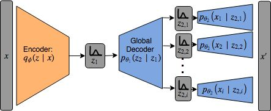
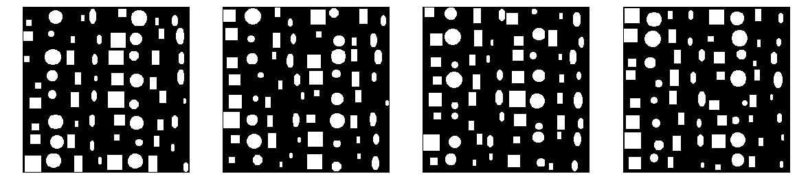

# Hierarchical Variational Autoencoder

A multi level VAE, where the image is modelled as a global latent variable indicating layout, and local latent variables for specific objects. Should be able to easily sample specific local details conditional on some global structure. This is shown below:

HVAE is implemented in pytorch, but currently isn't working. Need to investigate using weighting for KLD, proper loss as well as training on more natural images.

---

## Toy Shapes Dataset
To test the HVAE, a toy dataset similar to sorta-clevr is used. We generated 4 shapes of varying sizes, colors and locations:

These are then combined into a grid, to make a simple test for HVAE:

Create these datasets using [make_shape_data.py](make_shape_data.py).

---

## TODO:
* Update loss functions
* Check KLD weighting
* Train models for longer
* New dataset with more natural correlations

Using template from https://github.com/victoresque/pytorch-template